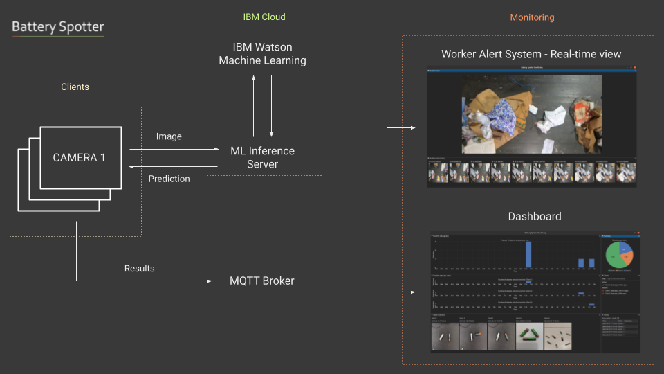

[](https://www.apache.org/licenses/LICENSE-2.0) [](https://developer.ibm.com/callforcode/solutions/projects/get-started/)

# Battery Spotter

- [Project summary](#project-summary)
  - [The issue we are hoping to solve](#the-issue-we-are-hoping-to-solve)
  - [How our technology solution can help](#how-our-technology-solution-can-help)
  - [Our idea](#our-idea)
- [Technology implementation](#technology-implementation)
  - [IBM AI service(s) used](#ibm-ai-services-used)
  - [Other IBM technology used](#other-ibm-technology-used)
  - [Solution architecture](#solution-architecture)
- [Presentation materials](#presentation-materials)
  - [Solution demo video](#solution-demo-video)
  - [Project development roadmap](#project-development-roadmap)
- [Additional details](#additional-details)
  - [Technical walkthrough](#technical-walkthrough)
  - [How to run the project](#how-to-run-the-project)
- [About](#about)
  - [Authors](#authors)
  - [License](#license)
  - [Acknowledgments](#acknowledgments)

## Project summary

### The issue we are hoping to solve

By 2030 we expect our worldwide battery consumption to generate 1.9M tonnes of battery waste every year. Improperly discarded batteries can be punctured, leak dangerous heavy metals and materials (polluting soils) and self-combust (polluting the air). This is especially dangerous when batteries are thrown in the bin as they cause massive fires in recycling facilities.

### How our technology solution can help

Battery Spotter detects batteries in real-time, alerts humans and collects data.

### Our idea

**A PRESSING PROBLEM**

By 2030 we expect our worldwide battery consumption to generate 1.9M tonnes of battery waste every year. But what happens to our batteries when they don’t hold the charge or stop working properly?

While many countries have battery recycling systems in place, they all rely on individuals to bring their batteries to a collection point in order to be processed and recycled. However, most people are not aware of nearby collection points or they don’t want the hassle of keeping and bringing their batteries themselves. According to Business Waste UK, 40% of Brits never recycled their batteries and 75% of the people interrogated didn’t know about the environmental damage it could cause. 

When batteries are thrown in the general waste bin, they most likely end up in landfills where they will leak heavy metals and pollute soils over time. Alternatively, they can be incinerated which means the hazardous chemicals will burn and pollute our atmosphere. 

When batteries are thrown away with recycling waste, they are the cause of dangerous fires as batteries can be punctured and self-combust. Given that recycling facilities process dry and highly combustible waste (cardboard, plastic, paper), fires spread extremely fast putting at risk workers and homes nearby. These are not independent incidents. In the UK only we’re talking about 700 fires every year costing the government over 158M GBP. While we can find data from rich countries such as the UK or the USA, the problem is also affecting poorer countries that not only have to deal with their own waste but also the waste dumped from all parts of the world. 

**OUR SOLUTION**

Battery Spotter uses machine learning and computer vision technologies to identify batteries early on the conveyor belt, alert workers to pick them up, and collect data to better size and track the problem. 

1. Battery identification - custom model

   The facility instals any off the shelf cameras as input devices to collect images of the waste on conveyor belts. Our custom model (neural network) is used to identify batteries in real time from these images. Several cameras can be placed in the same facility, for example at different steps of the process, but also be connected from different recycling facilities to collect data from different sites.

2. Worker Alert System - real time view

   The alert monitoring system provides a real-time view of the conveyor belt. It alerts workers when batteries are detected so they can pick the batteries and discard them properly, for example by putting them in a sandbag or other secure container.

   

3. Dashboard - monitoring system

   The dashboard enables a more global monitoring of the system and includes the list of cameras connected (online/offline camera and last ping), the number of batteries detected over time for each camera, as well as additional useful information. This information can be used to monitor the detection of batteries in the facility and track statistics at different scales (locations, periods of time,...).

   

**WHY IS IT STILL NOT ALREADY SOLVED?**

As previously highlighted, batteries can be well recycled in dedicated facilities but the process to separate and collect the batteries is left to individuals and is poorly known. 

Innovative startups using computer vision technology to improve our recycling capabilities exist, but they are still in their early days and do not specialise in batteries. They also require to adapt the recycling processes or installations already in place which slows down their adoption.

More detail is available in our [website](http://batteryspotterwebsite.s3-web.eu-gb.cloud-object-storage.appdomain.cloud/).

## Technology implementation

### IBM AI service(s) used

- IBM Watson Machine Learning - model inference (see inference server)

### Other IBM technology used

- IBM Cloud Object Storage - [website](http://batteryspotterwebsite.s3-web.eu-gb.cloud-object-storage.appdomain.cloud/) and TensorFlow model

### Solution architecture

Simplified diagram and step-by-step description of the flow of our solution:



1. The user sets up one or several cameras in their recycling facility and connects each of them to our system via a separate client (potentially running on a single lightweight computer such as a Raspberry Pi).
2. Clients connect to an inference server that detects batteries via our custom machine learning model (neural network) running on IBM Watson Machine Learning. Detections are sent back to their respective clients. No heavy computations are run at the facility. Clients share results to our monitoring systems via MQTT.
3. Results are displayed in real time to the facility workers to alert them when a battery is detected so that they can process them accordingly.
4. A dashboard provides a global view of the entire system to monitor the different events (battery detections) that occurred at the facility. It displays statistics for the different cameras and allows users to generate views about past events for any given period of time (for instance throughout the last hour or the last month).

## Presentation materials

### Solution demo video

<iframe width="560" height="315" src="https://www.youtube.com/embed/jrvhFf69Kbc" title="YouTube video player" frameborder="0" allow="accelerometer; autoplay; clipboard-write; encrypted-media; gyroscope; picture-in-picture; web-share" allowfullscreen></iframe>

### Project development roadmap

The project currently comprises 3 main components: our custom machine learning model, the real-time monitoring system to alert workers and the dashboard tracking battery detection per minute/day/week/month/year.

In the future, we would like to:

- Improve our model.
- Develop a mobile app to use a smartphone camera as input device. This would also make the adoption of our solution easier in poorer countries.
- Identify and work with a recycling facility partner to deploy our system in real life and gather feedback to test and improve our UI/UX.
- Explore potential funding options and grants to take the project further including the possibility of working on a solution that picks up batteries and removes them from the conveyor belt so that workers don’t have to do it themselves.

See below for our proposed roadmap for Battery Spotter after Call for Code 2023.


## Additional details

### Technical walkthrough

<iframe width="560" height="315" src="https://www.youtube.com/embed/UmTokEfV_6U" title="YouTube video player" frameborder="0" allow="accelerometer; autoplay; clipboard-write; encrypted-media; gyroscope; picture-in-picture; web-share" allowfullscreen></iframe>

Our custom model relies on the [EfficientDet](https://github.com/google/automl/tree/master/efficientdet) neural network implemented in TensorFlow and is trained on publicly available data from [Kaggle](https://www.kaggle.com/datasets/markcsizmadia/object-detection-batteries-dices-and-toy-cars) and [Roboflow](https://roboflow.com/). We also used the [ZeroWaste](http://ai.bu.edu/zerowaste/) dataset for testing and demonstration purposes. We provide a checkpoint that anyone can load to reproduce our results as well as a TFLite version that can be run on mobile and edge devices. We also provide the different scripts to run our different components (client, server, real time view, dashboard) and to deploy our model on IBM Watson Machine Learning.

For testing we use a Raspberry Pi Zero 2 W and a Raspberry Pi High Quality Camera.


### How to run the project

We describe for each component how to install dependencies and how to launch them. For testing purposes, all the components can be run on the same machine. As a prerequisite, a MQTT broker needs to run. MQTT_BROKER_ADDRESS and MQTT_BROKER_PORT respectively correspond to the address of the machine running the MQTT broker and its port. The first step consists in deploying the model to IBM Watson Machine Learning. Then, the inference server needs to be started so that clients can connect to it. Two clients are provided: one designed for Raspberry Pi and the Raspberry Pi Camera Module and another one processing images instead of a live feed from a camera. The latter is useful for development, testing and interoperability with third party components. Finally, one or both GUIs can be started: the real time view enables to monitor a specific client/camera, while the dashboard provides a global view on the entire system (multiple clients).

* Deploy model:

Create virtual environment and install dependencies: 

```
python3 -m venv venv_deploy
source venv_deploy/bin/activate
pip install -r requirements_deploy.txt
```

This step requires to have an IBM Watson Machine Learning instance ready with a deployment space. To deploy our custom model to IBM Cloud (replace IBM_API_KEY, IBM_URL and IBM_SPACE_ID with your values):

```
python3 deploy.py --ibm_api_key=IBM_API_KEY --ibm_url=IBM_URL --ibm_space_id=IBM_SPACE_ID --model_path=resources/efficient-d0-bat.tar.gz
```

On success, the script will provide the IBM_DEPLOYMENT_UID to use to run the inference server.

* Inference server:

Create virtual environment and install dependencies:

```
python3 -m venv venv_server
source venv_server/bin/activate
pip install -r requirements_server.txt
```

To launch the inference server with local inference (the server listens to clients on port SERVER_PORT):

```
python3 server.py --mode=local --port=SERVER_PORT --local_model_path=resources/efficientdet-d0-bat.tflite
```

To launch the inference server with remote inference via IBM Watson Machine Learning:

```
python3 server.py --mode=ibm_watson_machine_learning --port=SERVER_PORT --ibm_api_key=IBM_API_KEY --ibm_url=IBM_URL --ibm_space_id=IBM_SPACE_ID --ibm_deployment_uid=IBM_DEPLOYMENT_UID
```

* Raspberry PI client with support for camera:

Install system dependencies, create virtual environment and install Python dependencies:

```
sudo apt-get install python3-numpy python3-opencv

python3 -m venv venv_client_rpi_cam
source venv_client_rpi_cam/bin/activate
pip install -r requirements_client_rpi_cam.txt
```

To launch the Raspberry Pi client with camera support:

```
python3 client_rpi_cam.py --inference_server_address=INFERENCE_SERVER_ADDRESS --inference_server_port=INFERENCE_SERVER_PORT --mqtt_broker_address=MQTT_BROKER_ADDRESS --mqtt_broker_port=MQTT_BROKER_PORT --client_name=CLIENT_NAME
```

* Test client (uses image instead of camera):

Create virtual environment and install Python dependencies:

```
python3 -m venv venv_client_test
source venv_client_test/bin/activate
pip install -r requirements_client_test.txt
```

To launch test client that reads test images instead of using live camera feed:

```
python3 client_test.py --inference_server_address=INFERENCE_SERVER_ADDRESS --inference_server_port=INFERENCE_SERVER_PORT --mqtt_broker_address=MQTT_BROKER_ADDRESS --mqtt_broker_port=MQTT_BROKER_PORT --client_name=CLIENT_NAME
```

* GUIs (realtime view and dashboard):

Create virtual environment and install dependencies:

```
python3 -m venv venv_gui
source venv_gui/bin/activate
pip install -r requirements_gui.txt
```

To launch the dashboard:

```
python3 gui.py --mode=dashboard --mqtt_broker_address=MQTT_BROKER_ADDRESS --mqtt_broker_port=MQTT_BROKER_PORT
```

To launch real time monitoring interface for client CLIENT_NAME:

```
python3 gui.py --mode=realtime --mqtt_broker_address=MQTT_BROKER_ADDRESS --mqtt_broker_port=MQTT_BROKER_PORT --client_name=CLIENT_NAME
```


## About

### Authors

- Amandine Flachs
- Alexandre Borghi

### License

This project is licensed under the Apache 2 License - see the [LICENSE](LICENSE) file for details.

### Acknowledgments

- Based on [Billie Thompson's README template](https://gist.github.com/PurpleBooth/109311bb0361f32d87a2).
